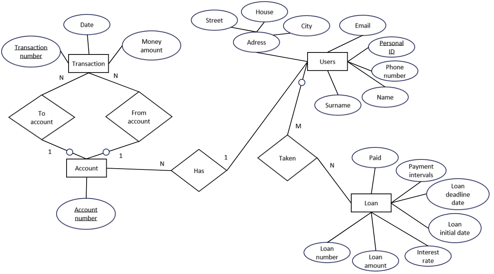

<p align="center">
  
</p>

## Table of Contents
- [Project Introduction](#project-introduction)
- [Learned Concepts](#learned-concepts)
- [Usage](#usage)

---

## Project Introduction

This project is part of my course work in creating connection between Java application and a postgreSQL database. The SQL script files for generating the database are provided. Below is an entity relation diagram (ERD) that shows the logic of the database and connection between tables.

Disclaimer: No tests have been implemented for this project yet.



---

## Learned Concepts

While doing this project I used postgreSQL and JDBC learning the following skills:
- To create and execute CRUD operations using JDBC (retrieve, insert various data into the database, etc.);
- To use the javax.swing package and create functional GUI;
- Building and using a postgreSQL database;
- In depth understanding on how JDBC interacts with postgreSQL database;
- How to prevent SQL injections and other important database construction concepts;

## Usage

To try and run this GUI, first of all you need to create a local postgreSQL database and specify the connection parameters in the following folder:
```{bash}
    ./src/main/resources/database.properties
```

Next go to the project directory and run the following maven command line:
```{bash}
    mvn package
```
Or, if you don't have maven installed, use the maven wrapper:
```{bash}
    ./mvnw package
```

After these steps you can go to **./target** and run the compiled JAR file:
```{bash}
    java -jar sqlproject-1.0-SNAPSHOT-jar-with-dependencies.jar 
```

Also you might need to configure you postgreSQL **TCP/IP** connections.